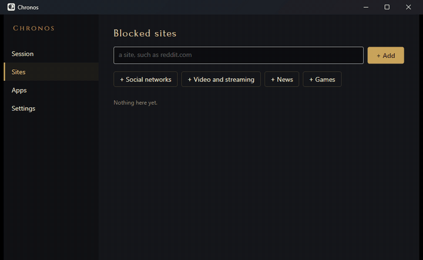
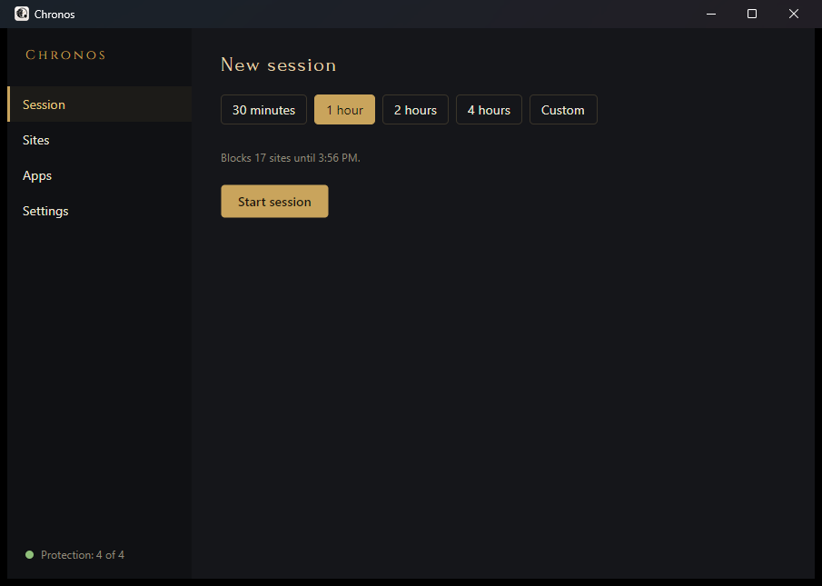
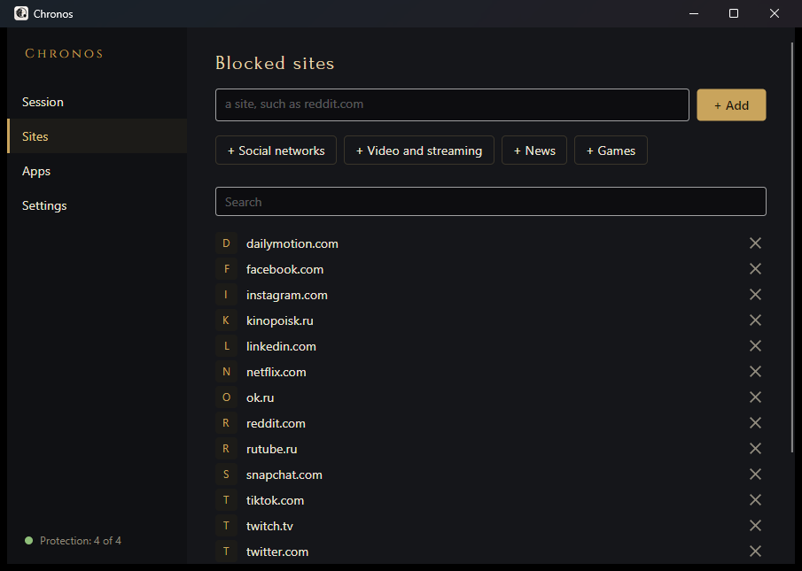
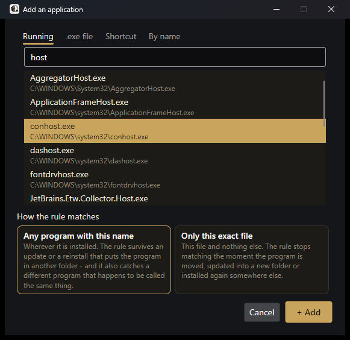
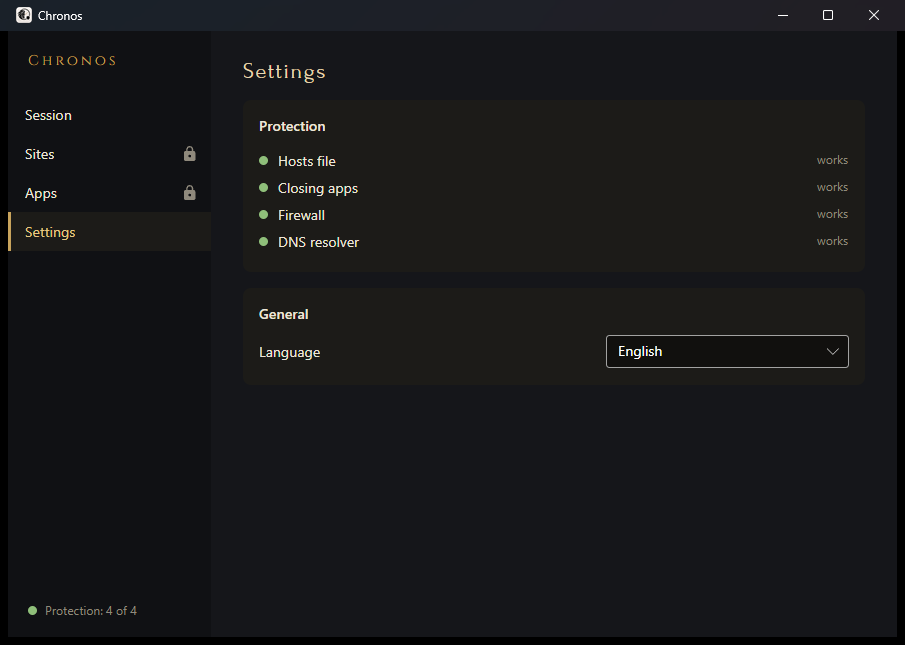
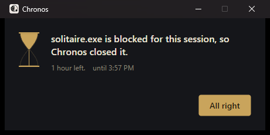
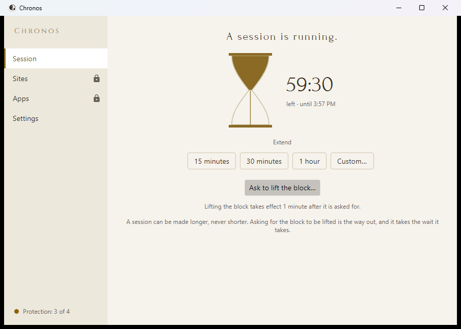

# Chronos

Chronos blocks the sites and apps you pick, on Windows, for as long as you say.

You can end a session early, but not quickly: you ask, and the block lifts after a wait you chose
before the session started. Closing the window, stopping the service or rebooting doesn't lift it.



## What it looks like

| | |
|---|---|
|  |  |
| Pick a length and start. | Add sites one by one or from ready-made sets. |
|  |  |
| Add an app from what's running, an `.exe`, a shortcut or a name. | See which blocking mechanisms work on this machine. |

When a blocked app starts, Chronos closes it and says so:



The window follows the Windows theme. Here is the light one:



## How it works

Chronos has three parts:

- **A Windows service** that does the blocking. It runs as LocalSystem and keeps the session even
  if you close everything else or reboot.
- **A tray app** for starting, extending and ending sessions and for editing your lists.
- **`chronos.exe`**, a command line for the same things, plus repair tools.

Sites are blocked three ways at once, so one failing doesn't open the door:

| Layer | What it does |
|---|---|
| hosts file | Points each blocked domain nowhere |
| Firewall | Drops traffic to the addresses those domains resolve to |
| DNS resolver | Answers blocked domains with "no such name" on `127.0.0.1:53` |

Apps are blocked by name or by exact path: the service watches for them to start and closes them.

If a layer can't work on your machine (another program holds port 53, a VPN drops local DNS
queries), the app tells you which one and why. The other layers keep working.

## Requirements

- Windows 10 or 11, 64-bit.
- Administrator rights to install. There's no mode that works without them: a block you could
  lift as a normal user wouldn't be much of a block.

Nothing else. The installer carries its own copy of .NET.

## Installing

Download `Chronos-<version>.msi` and run it, or:

```
msiexec /i Chronos-1.0.0.msi
```

The installer isn't signed, so Windows SmartScreen will warn about an unknown publisher. Click
**More info**, then **Run anyway**. You can check the file first:

```
certutil -hashfile Chronos-1.0.0.msi SHA256
```

and compare the result with `SHA256SUMS` from the release.

The installer puts Chronos in `C:\Program Files\Chronos`, starts the service, adds shortcuts to the
desktop and the Start Menu, and opens Chronos when it finishes. From then on the tray app starts
when you log in.

## Using it

1. Add sites and apps under **Sites** and **Apps**.
2. Under **Session**, pick 30 minutes, 1, 2 or 4 hours, or your own length (5 to 1440 minutes),
   and press **Start session**.
3. While the session runs you can add to the lists and make the session longer. You can't remove
   anything or make it shorter.
4. To stop early, press **Ask to lift the block**. The block lifts after the wait you set. You can
   change your mind while waiting.

The bottom of the sidebar shows how many blocking mechanisms are working. Click it for details.

## Removing it

```
msiexec /x Chronos-1.0.0.msi                 keeps your lists and logs
msiexec /x Chronos-1.0.0.msi REMOVEDATA=1    removes them too
```

Removing Chronos takes off the block, puts your DNS settings back and ends any running session.

## If something goes wrong

All three commands need an administrator prompt and work without the service.

- `chronos recover` checks whether the service is healthy. If it isn't, it removes the block and
  clears the session. It also runs by itself at every boot.
- `chronos clean` removes everything Chronos changed, right away.
- `chronos diag` writes a report about the machine into one archive and prints where it is.
  It changes nothing.

[docs/operations.md](docs/operations.md) has the details: what exactly changes on the machine,
how DNS settings are backed up and restored, and what a removal leaves behind.

## Command line

```
chronos <status|start|extend|unlock|cancel|watch|clean|recover|diag|install|uninstall>
        [--minutes N] [--purge] [--verbose]
```

| Exit code | Meaning |
|---|---|
| 0 | Done |
| 1 | Rejected, for example an unlock that is still waiting |
| 2 | Wrong arguments, or not run as administrator |
| 3 | The service can't be reached |
| 4 | Something on the machine couldn't be changed |

The command line and the logs are always in English. The tray app is in English or Russian.

## Known limitations

- **VPNs.** A VPN that resolves names through its own tunnel can bypass the DNS layer. Some VPNs
  (AmneziaVPN and other WireGuard-based clients) drop local DNS queries altogether. Chronos then
  turns the DNS layer off, says so, and blocks sites through the other two layers.
- **IPv6 DNS servers are not touched.** A reachable IPv6 resolver bypasses the DNS layer.
- **Port 53.** If another program already listens on `127.0.0.1:53`, the DNS layer stays off.
- **Updates to .NET** come with new Chronos releases, not through Windows Update.
- **Other users' autostart entries.** Each account that ran the tray app gets its own autostart
  entry. Removing Chronos clears only the entry of the account doing the removal.

The full list is in [docs/operations.md](docs/operations.md#known-limitations).

## Building from source

You need the .NET 10 SDK.

```
dotnet build -warnaserror
dotnet test
```

The installer is a separate project, not part of the solution:

```
dotnet build src/Chronos.Installer/Chronos.Installer.wixproj -c Release
```

The MSI ends up in `src/Chronos.Installer/bin/Release/Chronos.msi`.

## License

Chronos is licensed under the GNU General Public License v3.0; see [LICENSE](LICENSE). The bundled
fonts, Forum and Cinzel, are under the SIL Open Font License 1.1 (`assets/fonts`).
